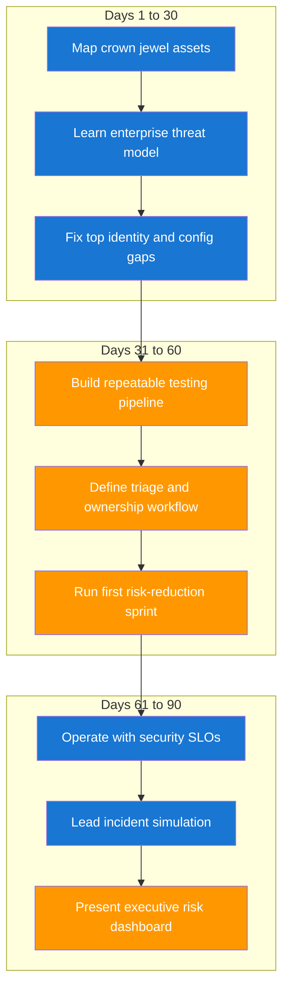

# 90 Day Learning Path from Senior Developer to Security Engineer

You do not need to master every security domain in one month. You need a disciplined sequence that builds judgment, practical testing skills, and organizational influence. This plan follows how a CISO would groom a high-potential engineer for broad enterprise impact.

## Progression Diagram



## Milestone Table

| Window | Primary Objective | Evidence of Progress |
|---|---|---|
| Days 1 to 30 | Understand org-specific risks and controls | Documented threat model and prioritized risk register |
| Days 31 to 60 | Create practical testing and remediation loop | Weekly vulnerability triage plus owner-linked tickets |
| Days 61 to 90 | Drive program reliability and leadership reporting | Security scorecard with trends and action plan |

## Real-World Milestone Examples

| Milestone | Example from Delivery Work | Remediation Pattern |
|---|---|---|
| Asset mapping | A customer portal exposes admin APIs behind a single gateway | Split routes, enforce role-scoped policies, and add gateway deny rules |
| Pipeline testing | A monorepo merges Terraform and app changes with no policy checks | Add IaC scanning, Policy Controller checks, and block merges on high-severity findings |
| Incident rehearsal | Simulated credential leak in CI logs | Rotate credentials, scrub logs, and enforce short-lived tokens |

```yaml
# Example pull request gate for security checks
name: security-gates
on: [pull_request]
jobs:
  checks:
    runs-on: ubuntu-latest
    steps:
      - uses: actions/checkout@v4
      - name: Trivy filesystem scan
        uses: aquasecurity/trivy-action@0.24.0
        with:
          scan-type: fs
          severity: HIGH,CRITICAL
          ignore-unfixed: true
      - name: Semgrep scan
        run: semgrep --config auto --error
      - name: Validate GKE manifests for baseline controls
        run: |
          test -f k8s/deployment.yaml && \
          grep -q "runAsNonRoot: true" k8s/deployment.yaml
```

| Developer Note | Keep in Mind |
|---|---|
| Scope discipline | Always get explicit authorization before active testing. |
| Evidence quality | Keep a short reproduction script with expected and actual result. |
| Closure quality | Mark findings complete only after re-test in an environment that mirrors production risk. |

## Risk Reduction Equation

A practical planning equation is risk reduced after controls and verification.

$$
R_r = \sum_{k=1}^{n}(L_k \times C_k \times V_k)
$$

| Symbol | Meaning |
|---|---|
| `R_r` | Total risk reduction in the planning period |
| `L_k` | Baseline loss exposure of risk item $k$ |
| `C_k` | Control effectiveness from 0 to 1 |
| `V_k` | Verification confidence from 0 to 1 |
| `n` | Number of remediated risk items |

If a high-loss risk is partially controlled but not verified, the real reduction stays low. This encourages strong follow-through, not only implementation.

??? question "What should I prioritize if leadership asks for fast wins?"
    Prioritize identity hardening, internet-facing misconfigurations, and high-severity dependency issues tied to crown jewel services.

??? question "How do I build trust with security teams quickly?"
    Bring clear evidence, avoid overclaiming, and close remediation loops with owners instead of handing off ambiguous findings.

--8<-- "_abbreviations.md"
