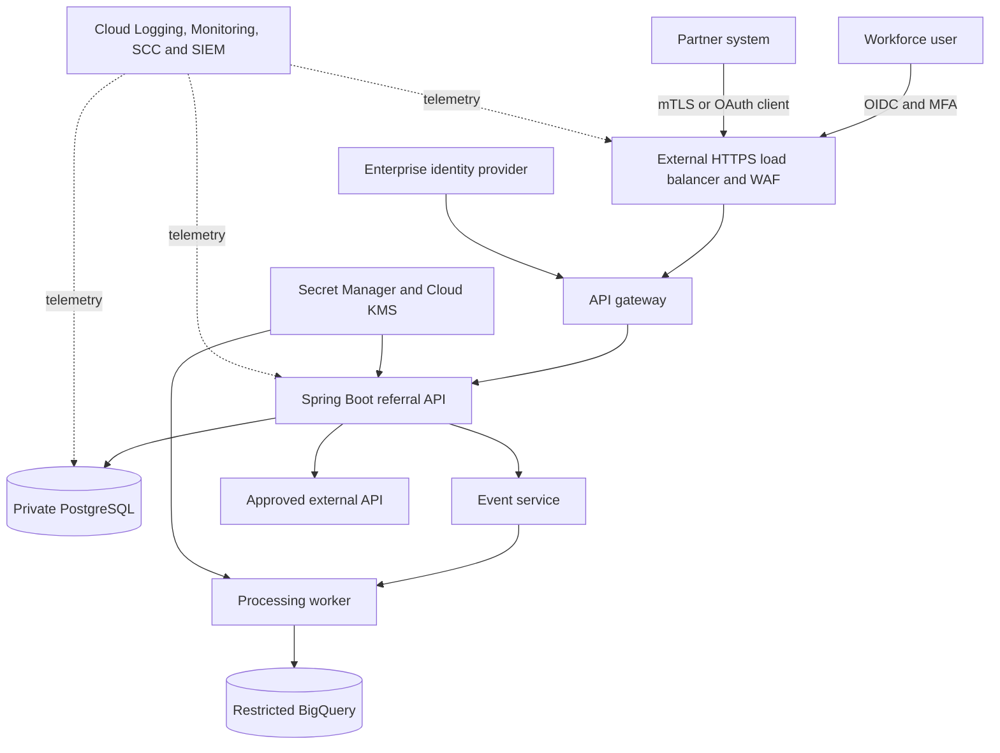

# Reference Enterprise System

All modules use one evolving, fictional healthcare workflow so decisions remain connected. Do not use real patient data, credentials, hostnames, project IDs, or internal architecture in exercises.

## Business Scenario

A care-coordination platform lets authenticated workforce users manage referrals, lets partner systems submit status updates, and produces de-identified operational analytics. Treat the transactional store as potentially PHI-bearing and verify classification with the designated privacy and security owners before deployment.

## Trust Boundaries

| Boundary | Primary Question | Failure Example |
|---|---|---|
| Internet to edge | Is the request allowed to reach an application endpoint? | Unrestricted automated abuse |
| Edge to API | Is caller identity validated and context preserved? | Gateway trusts an unverified token |
| User to tenant/resource | May this principal perform this action on this object? | Cross-tenant record access |
| API to database | Is workload identity least-privileged and query-safe? | Compromised API reads every record |
| Transactional to analytics | Is data minimized and purpose-limited? | PHI copied into a broad analytics dataset |
| Workload to external API | Is destination and outbound data authorized? | SSRF or unauthorized data egress |
| CI/CD to runtime | Are source, artifact, deployer, and provenance trusted? | Modified image reaches production |
| Operations to telemetry | Are logs useful without containing sensitive data? | PHI appears in request logs |

## Initial Insecure State

Begin exercises with these intentional defects:

- a valid JWT grants access without resource-level authorization;
- one broad service account is shared by API, worker, and deployment pipeline;
- database and analytics permissions exceed workload needs;
- outbound HTTP destinations are unrestricted;
- secrets are long-lived and manually rotated;
- logs contain request bodies and raw identifiers;
- images are mutable and deployment provenance is not checked;
- alerts exist, but no owner, runbook, or tested containment action is attached.

## Progressive Hardening Increments

| Increment | Control Outcome | Verification |
|---|---|---|
| Identity | Workforce and workload identities are distinct, short-lived, and lifecycle-managed | Token validation and disabled-user tests |
| Authorization | Tenant, role, purpose, action, and resource are evaluated server-side | Cross-tenant and privilege-negative tests |
| Data | Sensitive fields are minimized, encrypted, retained, and accessed by purpose | Data inventory and access-log review |
| Network | Private paths, explicit ingress, and destination-aware egress reduce reachability | Allowed/denied connectivity tests |
| Platform | Runtime, image, pod, and service-account privileges are constrained | Policy admission and escalation tests |
| Supply chain | Reviewed source produces verifiable, immutable artifacts | Signature and provenance verification |
| Detection | High-risk actions generate usable, privacy-safe signals | Detection replay and alert delivery test |
| Response | Credential, workload, data, and partner incidents have rehearsed containment | Tabletop evidence and action timestamps |

## Required Artifacts

Keep these artifacts current as the system evolves:

1. system context and data-flow diagrams;
2. asset and data inventory with owners and classification;
3. identity and authorization matrix;
4. threat register with attack paths and residual risk;
5. security decision records and approved exceptions;
6. negative test pack and CI/CD control evidence;
7. logging and detection catalog with runbook links;
8. incident timeline and after-action improvements.

Every exercise should change at least one artifact. This makes the curriculum a reusable security operating model rather than a collection of notes.
