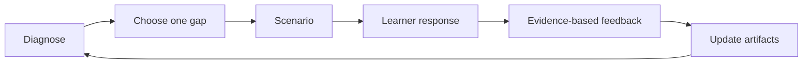

# Adaptive Learning System

The curriculum should adapt to demonstrated judgment, current delivery work, and changing risk. Do not advance only because a page was read.

## Start With a Diagnostic

For a selected domain, present one architecture decision, one suspicious signal, and one customer objection. Score the response using the rubric below, then choose the smallest lesson that closes the observed gap.

| Dimension | 0: Missing | 1: Developing | 2: Enterprise Ready |
|---|---|---|---|
| Asset and impact | No protected asset identified | Asset named without business impact | Asset, sensitivity, impact, and blast radius connected |
| Threat reasoning | Lists controls only | Names a threat without attack path | Actor, precondition, path, and likely outcome explained |
| Identity and trust | Assumes network location is trust | Identifies a principal | Traces identity, authorization, lifecycle, and boundary |
| Control design | Chooses a tool by default | Proposes one preventive control | Balances prevention, detection, response, and residual risk |
| Evidence | Relies on configuration intent | Suggests a happy-path test | Defines negative test, telemetry, owner, and review cadence |
| Communication | Uses absolute or alarmist language | Explains technical issue | Frames options, trade-offs, uncertainty, and recommendation |

## Routing Rules

- Any score of `0`: return to a focused concept and a small worked example.
- Mostly `1`: run a hands-on change against the reference system.
- All `2`: introduce a constraint such as legacy identity, multi-tenancy, PHI, outage pressure, or delivery deadline.
- Strong design but weak evidence: move to testing, observability, or incident simulation.
- Strong implementation but weak communication: use an FDE customer role-play.
- Repeated success: revisit after 30 days with a changed threat or architecture.

## Session Loop

## Feedback Format

Feedback must separate correctness from preference:

1. **What was strong:** accurate reasoning worth preserving.
2. **What was missed:** asset, attack path, trust boundary, or operational dependency.
3. **Why it matters:** realistic impact without exaggeration.
4. **Better decision:** recommended control and alternatives.
5. **Proof:** negative test, telemetry, or review evidence.
6. **Customer framing:** concise language suitable for delivery teams and risk owners.

Do not reveal the complete answer before the learner attempts threat identification or incident triage. Do not manufacture internal policy. Label assumptions and direct the learner to the authoritative owner or approved internal standard.

## Scenario Difficulty Controls

| Lever | Easier | Harder |
|---|---|---|
| Exposure | Internal test service | Internet-facing production path |
| Data | Synthetic data | Regulated or highly sensitive data |
| Identity | One workforce role | Workforce, partner, workload, and tenant identities |
| Architecture | Single service | Event-driven multi-project platform |
| Operations | Planned change | Active incident or outage |
| Evidence | Complete logs | Partial, delayed, or conflicting telemetry |
| Stakeholders | Cooperative team | Deadline, cost, and compliance conflict |

## Learning Record

Track only non-sensitive learning metadata:

| Field | Purpose |
|---|---|
| Domain and scenario | Shows coverage without storing customer details |
| Rubric scores | Identifies the next learning gap |
| Decision and assumptions | Makes reasoning reviewable |
| Evidence produced | Distinguishes knowledge from demonstrated ability |
| Residual risk | Prevents a false sense of completion |
| Revisit date | Supports spaced practice and control freshness |

## Definition of Mastery

Mastery means independently producing a defensible decision under ambiguity. The learner must identify what is known, what must be verified, who owns acceptance, what can fail, how failure is detected, and how the organization recovers.
