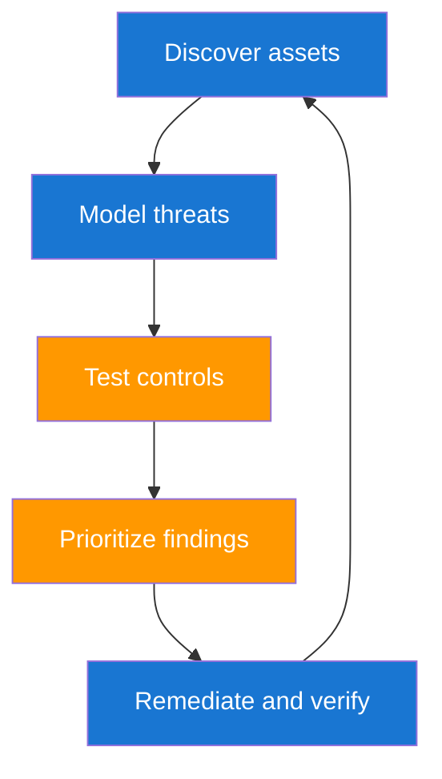

# Core Concepts for Enterprise Security Engineers

Enterprise security is about reducing the chance and impact of bad outcomes in real business systems. You are not trying to create perfect security on day one. You are building a repeatable process that finds high-risk weaknesses, validates them, and gets them fixed.

## Security Control Loop



## Core Concept Comparison

| Concept | Practical Meaning | Common Mistake |
|---|---|---|
| Threat modeling | Predict realistic abuse paths for your architecture | Treating it as one-time documentation |
| Vulnerability management | Detect, triage, fix, and verify weaknesses | Stopping after scanning |
| Security testing | Validate controls through static, dynamic, and manual methods | Running tests without defined scope |
| Risk governance | Track risk ownership and treatment decisions | Logging risk with no accountable owner |

## Basic Risk Scoring Model

Use a simple equation to explain prioritization in engineering terms.

$$
R = L \times P \times E
$$

| Symbol | Meaning |
|---|---|
| `R` | Risk score used for ranking remediation work |
| `L` | Loss impact if exploited |
| `P` | Probability of successful attack |
| `E` | Exposure factor representing reachability and control weakness |

A medium-severity issue on a public, high-value service can score higher than a nominally high-severity issue on an isolated internal test box.

## Real-World Example: Broken Authorization on Cloud Run Order APIs

An internal review finds that a Cloud Run endpoint for reading order details accepts any valid JWT but does not verify tenant ownership. A user from tenant A can query order IDs from tenant B by iterating predictable numeric IDs. This is a common enterprise failure mode because authentication exists, but authorization boundaries are incomplete.

```python
# Simplified anti-pattern and fix illustration
def get_order(order_id, current_user):
    order = db.orders.find_one({"id": order_id})

    # BAD: only checks authentication, not tenant authorization
    # if not current_user:
    #     raise PermissionError("unauthenticated")

    # GOOD: enforce tenant boundary and role
    if order["tenant_id"] != current_user["tenant_id"]:
        raise PermissionError("cross-tenant access denied")
    if "order:read" not in current_user["permissions"]:
        raise PermissionError("missing permission")

    return order
```

| Remediation Step | Why It Works | Verification |
|---|---|---|
| Add tenant and role checks at service layer | Blocks cross-tenant data access | Unit and integration tests fail on mismatched tenant IDs |
| Add API Gateway and Cloud Armor policy as defense-in-depth | Reduces blast radius if app checks regress | Gateway policy tests deny invalid scope |
| Log authorization denials with trace IDs | Speeds incident investigation | Denial events are searchable in Cloud Logging and SIEM |
| Add regression test for IDOR pattern | Prevents recurrence in future releases | CI fails on unauthorized data exposure |

```bash
# Quick negative test example
curl -H "Authorization: Bearer $TENANT_A_TOKEN" \
  "https://api.example.com/orders/tenant-b-order-id" -i
```

Expected result is `403` with no sensitive payload.

??? question "What should I do first in a new enterprise environment?"
    Build an asset inventory and identify crown jewel systems. Without this baseline, testing effort spreads too thin and misses high-value risk.

??? question "How do I avoid noise fatigue from scanners?"
    Combine automated findings with exploitability checks and business context. Promote only validated and owner-actionable items into top-priority queues.

??? question "What makes a finding enterprise-ready?"
    It includes affected asset, exploit evidence, business impact, owner mapping, and a verification step after remediation.

--8<-- "_abbreviations.md"
