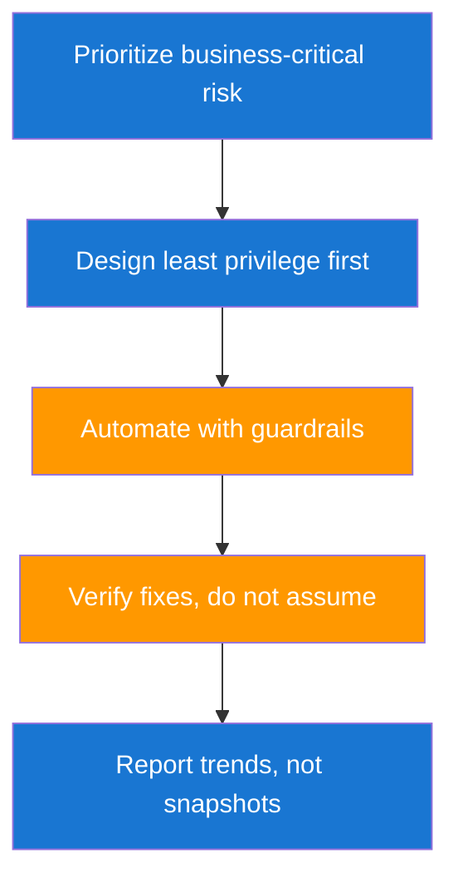

# Key Principles for Security Decision-Making

Strong security engineers make trade-offs that improve outcomes without paralyzing delivery. In enterprise settings, perfect controls are rare and context changes fast. These principles help you make consistent decisions under uncertainty.

## Principle Stack



## Principle Application Table

| Principle | Engineering Behavior | Organization Impact |
|---|---|---|
| Business-critical first | Rank by exploitability plus impact | Faster reduction of meaningful risk |
| Least privilege | Short-lived scoped credentials and RBAC hygiene | Lower blast radius |
| Automation with guardrails | Policy checks before high-risk actions | Safer and faster test cycles |
| Verify fixes | Re-test with explicit closure criteria | Lower recurrence of vulnerabilities |
| Trend reporting | Weekly scorecards with direction and causes | Better leadership decisions |

## Security Quality Equation

A balanced quality signal includes productivity and control strength.

$$
Q_s = \frac{F_v \times C_s}{1 + E_h}
$$

| Symbol | Meaning |
|---|---|
| `Q_s` | Security program quality signal |
| `F_v` | Number of verified fixes in period |
| `C_s` | Control stability score from 0 to 1 |
| `E_h` | High-severity exceptions requiring escalation |

This equation rewards teams that both fix risk and reduce operational turbulence.

## Real-World Example: Least Privilege for GCP CI Deployments

A common anti-pattern is using one long-lived project-owner credential for all deployments. It speeds up initial setup but makes incident response difficult and increases blast radius. A better model uses Workload Identity Federation and role-scoped service accounts per environment.

```json
{
    "title": "ordersDeployer",
    "description": "Least-privilege deploy role for one Cloud Run service",
    "stage": "GA",
    "includedPermissions": [
        "run.services.get",
        "run.services.update",
        "artifactregistry.repositories.downloadArtifacts"
    ]
}
```

```bash
# Create custom role and bind to CI service account in one project
gcloud iam roles create ordersDeployer \
  --project "$PROJECT_ID" \
  --file role.json

gcloud projects add-iam-policy-binding "$PROJECT_ID" \
  --member="serviceAccount:ci-orders@$PROJECT_ID.iam.gserviceaccount.com" \
  --role="projects/$PROJECT_ID/roles/ordersDeployer"
```

| Remediation Step | Result |
|---|---|
| Replace static keys with Workload Identity Federation | Removes standing privileged secrets from CI |
| Split deploy service accounts by environment and service | Limits accidental or malicious cross-service changes |
| Require approval for production deployment workflows | Adds human control to highest-risk actions |
| Rotate legacy keys and disable inactive service account keys | Shrinks attacker dwell-time options |

| Developer Watch-out | Recommended Guardrail |
|---|---|
| Broad roles like `roles/editor` for convenience | Service-specific custom roles with only required permissions |
| Skipping post-change validation | Include smoke and auth checks after every deployment |
| Hidden emergency exceptions | Track exceptions with expiry dates and owner reviews |

??? question "How do I handle a conflict between release speed and security controls?"
    Use risk-tiered controls with explicit exceptions and time limits. This keeps delivery moving while preserving accountability and follow-up.

??? question "What principle creates the biggest improvement early?"
    Verification discipline creates immediate value because it turns security from reporting into measurable risk reduction.

--8<-- "_abbreviations.md"
