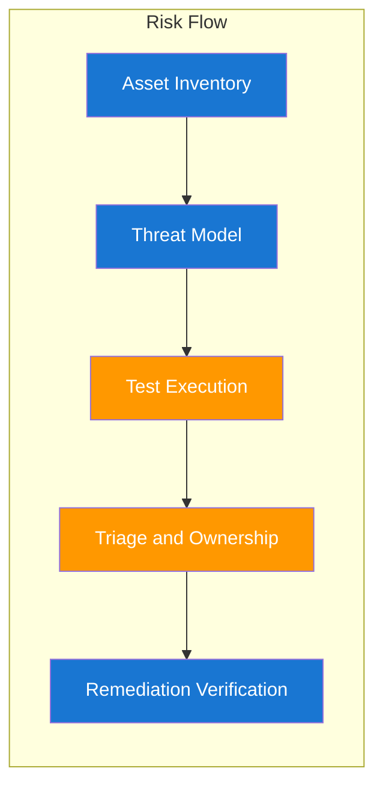

# Building Blocks for Enterprise Security Programs

At this stage you are moving from understanding concepts to designing repeatable systems. The key is to make security work visible, assignable, and testable across teams. These building blocks create the backbone of a sustainable program.

## Capability Architecture



## Building Block Responsibilities

| Building Block | Owner | Success Signal |
|---|---|---|
| Asset inventory and classification | Platform plus security | Critical assets tagged and current in Cloud Asset Inventory |
| Threat modeling workflow | Security architecture | Threats tied to controls and owners |
| Automated test pipeline | AppSec and engineering | Scheduled tests with low failure noise |
| Triage and assignment process | Security operations | High-risk findings assigned quickly |
| Verification and closure loop | Service teams plus AppSec | Closed findings have proof of fix |

## Coverage Equation

Weighted coverage keeps focus on important systems.

$$
C_w = \frac{\sum_{i=1}^{n}(w_i \cdot t_i)}{\sum_{i=1}^{n} w_i}
$$

| Symbol | Meaning |
|---|---|
| `C_w` | Weighted coverage score |
| `w_i` | Criticality weight of asset $i$ |
| `t_i` | Tested state of asset $i$, 1 for tested and 0 for not tested |
| `n` | Number of assets in scope |

## Real-World Example: GCP Security Control Pipeline in CI

Teams often have scanning tools but no standard flow for assignment and closure. The missing piece is a deterministic pipeline that converts findings into owner-ready work with severity gates.

```yaml
name: appsec-pipeline
on:
    push:
        branches: [main]
jobs:
    scan-and-triage:
        runs-on: ubuntu-latest
        steps:
            - uses: actions/checkout@v4
            - name: Run Trivy
                            run: trivy fs --format sarif --output trivy.sarif .
            - name: Run Semgrep
                            run: semgrep --config auto --sarif --output semgrep.sarif src/
                        - name: GCP IAM posture quick check
                            run: |
                                gcloud projects get-iam-policy "$PROJECT_ID" \
                                    --format=json > iam-policy.json
            - name: Fail on critical findings
                            run: jq -e '.runs[].results[] | select(.level=="error")' semgrep.sarif >/dev/null
```

| Remediation Runbook | Owner | Exit Criteria |
|---|---|---|
| Validate finding against runtime context | AppSec engineer | Confirmed true positive with reproduction notes |
| Map issue to service owner and backlog sprint | Engineering manager | Ticket accepted with severity and SLA |
| Implement patch and add regression test | Service team | Patch merged with passing tests |
| Re-scan and mark verified | AppSec plus service team | Evidence artifact attached and issue closed |

| Developer Note | Keep in Mind |
|---|---|
| Signal quality matters more than tool count | Start with fewer checks and high trust, then expand. |
| SLA without ownership fails | Every high-severity issue must map to one accountable team. |
| Verification cannot be skipped | A merged PR is not a remediated risk until re-tested. |

??? question "How should I start when inventory data is incomplete?"
    Begin with internet-facing services and systems tied to sensitive data. Improve inventory quality while you run first-pass controls.

??? question "What is the most common failure in building these blocks?"
    Teams build scanning first but skip ownership and verification. Without those, finding volume grows while risk reduction stalls.

--8<-- "_abbreviations.md"
