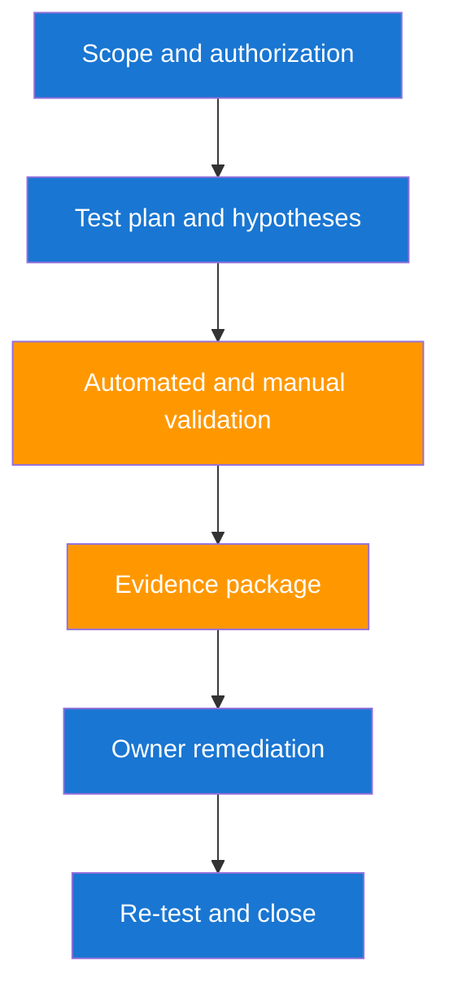

# Practical Security Testing Applications

This section turns architecture into operational drills you can run with your organization. The goal is to build confidence in both technical execution and cross-team communication. Each scenario should end with a verified remediation outcome.

## Practical Testing Lifecycle



## Scenario Practice Matrix

| Scenario | Security Consideration | Validation Artifact |
|---|---|---|
| Public API auth bypass risk | Enforce authZ checks and token boundaries | Repro script with expected deny response |
| GCP secret exposure | Restrict Secret Manager access and rotate compromised secrets | Rotation proof and IAM policy diff |
| GKE privilege escalation | Harden Kubernetes RBAC and Workload Identity | Before and after policy snapshot |
| Dependency vulnerability on core service | Patch with compatibility testing | SBOM delta and regression test pass |

## Risk Burn-Down Model

Use a simple model to explain progress from sprint to sprint.

$$
B_r = R_0 - \sum_{j=1}^{m}(M_j \times V_j)
$$

| Symbol | Meaning |
|---|---|
| `B_r` | Remaining risk backlog after remediation cycle |
| `R_0` | Initial measured risk backlog |
| `M_j` | Mitigation value of item $j$ |
| `V_j` | Verification confidence of item $j$ from 0 to 1 |
| `m` | Number of completed remediation items |

## Real-World Drill: API Authorization Regression Test

One frequent production incident is an endpoint added without permission checks during a fast release. Run an explicit negative test in CI to confirm unauthorized users cannot access protected resources.

```bash
# unauthorized user should not read admin endpoint
curl -s -o /dev/null -w "%{http_code}\n" \
    -H "Authorization: Bearer $NON_ADMIN_TOKEN" \
    https://api.example.com/admin/audit-logs
```

Expected code is `403`. Any `200` response is a release blocker.

## Real-World Drill: GKE Privilege Escalation Check

```bash
# find pods running as root or with privileged mode in GKE
kubectl get pods -A -o json | jq -r '
    .items[] |
    .metadata.namespace as $ns |
    .metadata.name as $pod |
    .spec.containers[] |
    select((.securityContext.runAsNonRoot != true) or (.securityContext.privileged == true)) |
    "\($ns)/\($pod): container=\(.name)"
'
```

| Remediation Step | Technical Action | Verification |
|---|---|---|
| Enforce pod security baseline | Set `runAsNonRoot: true` and remove privileged mode | Admission policy blocks non-compliant pods |
| Restrict service account permissions | Replace broad cluster roles with namespace-scoped roles | Access checks fail for disallowed actions |
| Add admission guardrails | Use GKE Policy Controller constraints in cluster | Violations are rejected before deploy |

| Developer Watch-out | Practical Advice |
|---|---|
| Testing only happy path | Always include negative and abuse-path tests. |
| Ignoring stale auth tokens in tests | Rotate test tokens and enforce short TTLs. |
| No rollback plan | Keep a tested rollback for high-risk security changes. |

??? question "How often should I run practical drills?"
    Run one focused scenario each week and one cross-team simulation each month. This cadence builds capability without exhausting teams.

??? question "How do I prevent friction with product teams?"
    Deliver concise, owner-ready findings and align remediation priority with service reliability and business milestones.

--8<-- "_abbreviations.md"
