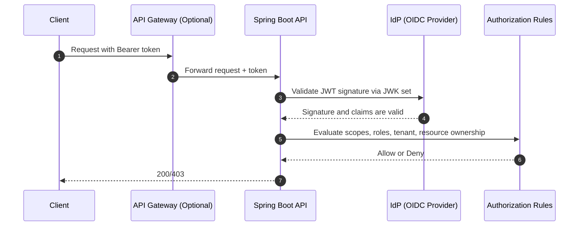
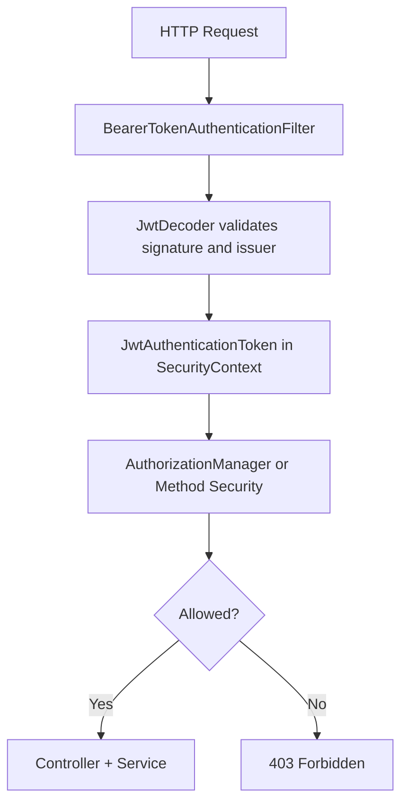

# Spring Boot API Security: Connecting Authentication to Authorization

When building APIs quickly, it is common to validate that a token exists and then proceed. That pattern creates a dangerous gap: authentication proves who the caller is, but authorization decides what the caller is allowed to do.

This page connects the full path from incoming request to allow or deny decision in a Spring Boot microservices architecture, with a GCP-oriented deployment model.

## The Dot-Connection You Need



Key point:

- Authentication: Is this token valid and trustworthy?
- Authorization: Can this identity perform this action on this resource?

You need both.

## Common Anti-Pattern in Microservices

Anti-pattern:

1. API receives token.
2. API calls a security microservice only to parse or verify token.
3. API trusts success and allows business action.

Why this fails:

- It checks identity presence, not permission boundaries.
- It often skips resource-level checks such as tenant ownership.
- It can become fail-open when the security service is degraded.

Better approach:

1. Let each API act as a Spring Security Resource Server.
2. Validate JWT locally using issuer and JWK metadata.
3. Enforce authorization in the API using scopes, roles, and domain checks.
4. Keep central policy definitions, but enforce at the edge of each service.

## Spring Security Request Flow



## Minimal Secure Configuration (Spring Boot 3)

```java
@Configuration
@EnableMethodSecurity
public class SecurityConfig {

    @Bean
    SecurityFilterChain securityFilterChain(HttpSecurity http) throws Exception {
        http
            .csrf(csrf -> csrf.disable())
            .authorizeHttpRequests(auth -> auth
                .requestMatchers("/actuator/health").permitAll()
                .requestMatchers(HttpMethod.GET, "/api/orders/**").hasAuthority("SCOPE_orders.read")
                .requestMatchers(HttpMethod.POST, "/api/orders/**").hasAuthority("SCOPE_orders.write")
                .anyRequest().authenticated()
            )
            .oauth2ResourceServer(oauth2 -> oauth2
                .jwt(jwt -> jwt.jwtAuthenticationConverter(jwtAuthConverter()))
            );

        return http.build();
    }

    @Bean
    Converter<Jwt, ? extends AbstractAuthenticationToken> jwtAuthConverter() {
        JwtGrantedAuthoritiesConverter scopes = new JwtGrantedAuthoritiesConverter();
        scopes.setAuthorityPrefix("SCOPE_");
        scopes.setAuthoritiesClaimName("scope");

        return jwt -> {
            Collection<GrantedAuthority> authorities = new ArrayList<>(scopes.convert(jwt));

            // Optional: map custom claim roles -> ROLE_* authorities
            List<String> roles = jwt.getClaimAsStringList("roles");
            if (roles != null) {
                roles.forEach(role -> authorities.add(new SimpleGrantedAuthority("ROLE_" + role)));
            }

            return new JwtAuthenticationToken(jwt, authorities);
        };
    }
}
```

application.yaml:

```yaml
spring:
  security:
    oauth2:
      resourceserver:
        jwt:
          issuer-uri: https://issuer.example.com
```

## Resource-Level Authorization (The Part Teams Miss)

Scopes alone are not enough. You also need domain checks such as tenant and ownership.

```java
@Service
public class OrderAuthorizationService {

    public void assertCanReadOrder(JwtAuthenticationToken auth, Order order) {
        String callerTenant = auth.getToken().getClaimAsString("tenant_id");
        if (!order.getTenantId().equals(callerTenant)) {
            throw new AccessDeniedException("Cross-tenant access denied");
        }
    }
}
```

Use it in service methods:

```java
@Service
public class OrderService {

    private final OrderRepository repository;
    private final OrderAuthorizationService orderAuthz;

    public OrderService(OrderRepository repository, OrderAuthorizationService orderAuthz) {
        this.repository = repository;
        this.orderAuthz = orderAuthz;
    }

    @PreAuthorize("hasAuthority('SCOPE_orders.read')")
    public Order getOrder(String id, JwtAuthenticationToken auth) {
        Order order = repository.findById(id)
            .orElseThrow(() -> new EntityNotFoundException("Order not found"));

        orderAuthz.assertCanReadOrder(auth, order);
        return order;
    }
}
```

## GCP Deployment Mapping

| Security Need | Spring Boot API | GCP Layer |
|---|---|---|
| Token trust | Resource Server JWT validation | Identity provider + OIDC metadata |
| Network protection | TLS + route guards | API Gateway, Cloud Armor |
| Secret handling | No embedded credentials | Secret Manager |
| Service identity | Workload identity over static keys | GCP Workload Identity Federation |
| Audit and forensics | AuthN/AuthZ decision logs | Cloud Logging + SCC correlation |

## Failure Modes and Remediation Steps

| Failure Mode | What It Looks Like | Remediation |
|---|---|---|
| Token presence only | Any valid token can access privileged API | Add route-level authorities and method-level checks |
| Missing tenant boundary | Cross-tenant data exposure | Enforce tenant claim to resource tenant match |
| Fail-open auth service dependency | Security checks bypassed during outage | Validate JWT locally in each API and fail closed |
| Over-trusted internal network | East-west calls skip auth headers | Require mTLS and token validation for service-to-service calls |
| Broad role mapping | Users get excessive permissions | Use least-privilege scopes and explicit role mapping |

## Practical Test Cases You Should Keep in CI

```bash
# 1) Missing token should be denied
curl -i https://api.example.com/api/orders/123

# 2) Wrong scope should be denied
curl -i -H "Authorization: Bearer $TOKEN_WITHOUT_ORDERS_READ" \
  https://api.example.com/api/orders/123

# 3) Cross-tenant token should be denied
curl -i -H "Authorization: Bearer $OTHER_TENANT_TOKEN" \
  https://api.example.com/api/orders/123
```

Expected:

- Missing token: 401
- Wrong scope: 403
- Cross-tenant access: 403

## Security Checklist for Every New API

1. Have I configured the API as a JWT resource server?
2. Do I enforce route-level scope or authority checks?
3. Do I enforce resource-level checks such as tenant or ownership?
4. Do denied requests return 401 or 403 correctly?
5. Are AuthN/AuthZ decisions logged with request correlation IDs?
6. Do CI tests include negative authorization cases?

## Day-to-Day Engineering Guardrails for Spring APIs

These habits prevent most authorization bugs before code review.

| Layer | Guardrail | Why It Prevents Security Bugs |
|---|---|---|
| Controller | Keep controller thin and delegate decisions to service methods with explicit auth context | Reduces accidental bypass logic in endpoints |
| Service | Enforce business authorization in domain services, not only URL rules | Catches resource-level abuse paths |
| Repository | Always query with tenant or ownership predicates for sensitive data | Prevents IDOR and cross-tenant leakage |
| DTO mapping | Use allow-list field mapping for updates | Prevents mass assignment privilege escalation |
| Error handling | Return generic access errors without leaking policy internals | Limits attacker feedback for enumeration |

Example tenant-safe repository pattern:

```java
public interface OrderRepository extends JpaRepository<Order, String> {
    Optional<Order> findByIdAndTenantId(String id, String tenantId);
}
```

```java
@PreAuthorize("hasAuthority('SCOPE_orders.read')")
public Order getOrderSafe(String id, JwtAuthenticationToken auth) {
    String tenantId = auth.getToken().getClaimAsString("tenant_id");
    return repository.findByIdAndTenantId(id, tenantId)
        .orElseThrow(() -> new AccessDeniedException("Order not accessible"));
}
```

## Method Security for Domain Rules

Route-level checks are not enough when permissions depend on resource ownership or state.

```java
@Component("orderPolicy")
public class OrderPolicy {

    public boolean canCancel(JwtAuthenticationToken auth, Order order) {
        String tenant = auth.getToken().getClaimAsString("tenant_id");
        boolean sameTenant = tenant.equals(order.getTenantId());
        boolean hasScope = auth.getAuthorities().stream()
            .anyMatch(a -> a.getAuthority().equals("SCOPE_orders.cancel"));
        boolean cancellable = !order.getStatus().isTerminal();

        return sameTenant && hasScope && cancellable;
    }
}
```

```java
@PreAuthorize("@orderPolicy.canCancel(authentication, #order)")
public void cancelOrder(Order order) {
    // business action
}
```

## Security Tests You Should Run on Every Pull Request

Use spring-security-test so auth behavior is verified automatically in CI.

```java
@AutoConfigureMockMvc
@SpringBootTest
class OrderSecurityTests {

    @Autowired
    MockMvc mvc;

    @Test
    void missingToken_is401() throws Exception {
        mvc.perform(get("/api/orders/123"))
            .andExpect(status().isUnauthorized());
    }

    @Test
    void wrongScope_is403() throws Exception {
        mvc.perform(get("/api/orders/123")
                .with(jwt().authorities(new SimpleGrantedAuthority("SCOPE_profile.read"))))
            .andExpect(status().isForbidden());
    }

    @Test
    void validScopeAndTenant_is200() throws Exception {
        mvc.perform(get("/api/orders/123")
                .with(jwt().jwt(j -> j.claim("tenant_id", "tenant-a"))
                .authorities(new SimpleGrantedAuthority("SCOPE_orders.read"))))
            .andExpect(status().isOk());
    }
}
```

## Practical Anti-Patterns and Safer Replacements

| Anti-Pattern | Safer Replacement |
|---|---|
| Parse token in custom filter and trust userId header | Use Resource Server JWT verification + SecurityContext |
| Global admin role for all internal jobs | Dedicated service accounts and narrow scopes per job |
| Checking role only at controller | Enforce policy again in service/domain layer |
| Returning full object before authz filter | Fetch only authorized resource using tenant-aware query |
| Accepting arbitrary fields in PATCH update | Validate input and map only allowed fields |

## A Simple Decision Rule

If your API only answers the question "is this caller authenticated?" and not "is this caller authorized for this exact action and resource?", the API is incomplete from a security standpoint.

--8<-- "_abbreviations.md"
