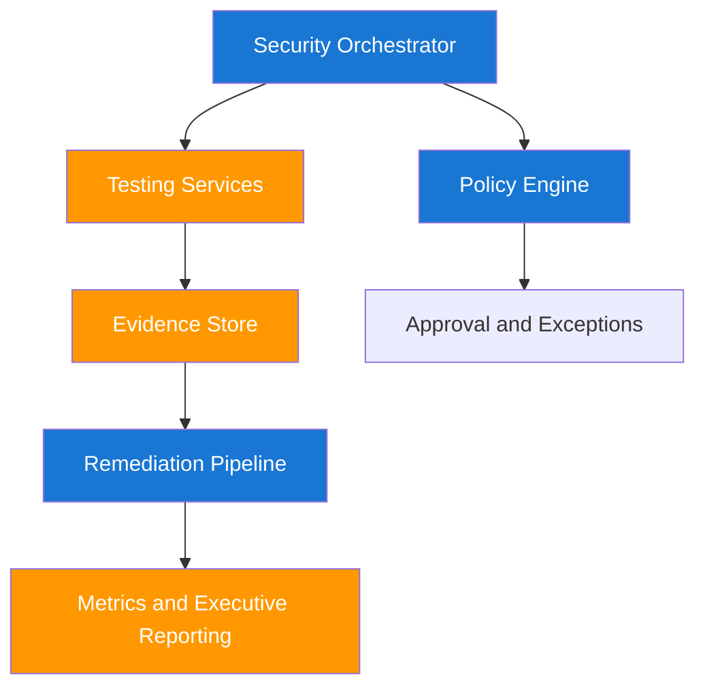

# Advanced Patterns for Enterprise Security Leadership

Advanced security engineering is about scalable decision systems, not heroics. You need patterns that continue working as teams, services, and threat complexity grow. This page outlines governance and execution models for that scale.

## Governance-Centric Security Pattern



## Pattern Selection Table

| Pattern | Best Use | Strength | Risk |
|---|---|---|---|
| Central policy gateway | Regulated environments | Consistent control enforcement | Throughput bottlenecks |
| Federated testing teams | Large distributed engineering orgs | Local velocity and domain context | Inconsistent quality without standards |
| Evidence-first remediation | High false-positive environments | Higher trust and faster closure | Slower initial reporting |
| Staged rollout with canaries | New control or tool deployments | Safe progressive adoption | Longer path to full deployment |

## Security Maturity Growth Model

A maturity model helps explain long-term improvement in a measurable way.

$$
M_g = \frac{C_a \times R_v}{O_f + D_t}
$$

| Symbol | Meaning |
|---|---|
| `M_g` | Security maturity growth indicator |
| `C_a` | Coverage of critical assets |
| `R_v` | Verified risk reduction |
| `O_f` | Operational friction index |
| `D_t` | Detection and response delay index |

## Real-World Pattern: Policy-as-Code for GKE Deployment Control

When multiple teams deploy independently, policy drift becomes a reliability risk. Policy-as-code in GKE with Policy Controller creates consistent, reviewable control logic that can block unsafe deployments early.

```rego
package deployment.security

deny[msg] {
    input.kind == "Deployment"
    c := input.spec.template.spec.containers[_]
    not c.securityContext.runAsNonRoot
    msg := "container must run as non-root"
}

deny[msg] {
    input.kind == "Deployment"
    c := input.spec.template.spec.containers[_]
    c.securityContext.privileged == true
    msg := "privileged containers are not allowed"
}
```

| Remediation Strategy | Enterprise Outcome |
|---|---|
| Start in audit mode for two sprints | Teams see impact before enforcement |
| Publish policy cookbook with compliant examples | Faster team adoption and fewer deployment failures |
| Enforce only high-confidence policies first | Reduced false-positive pushback |
| Add exception workflow with expiry | Prevents permanent policy bypass |

| Developer Note | Why It Matters |
|---|---|
| Version policies with semantic releases | Lets teams coordinate upgrades safely |
| Test policies in CI with fixture manifests | Catches policy bugs before production blockers |
| Track policy violation trends by domain | Reveals training and platform gaps |

??? question "How do I lead security change without becoming a bottleneck?"
    Define clear standards and guardrails centrally, then let service teams execute locally with shared scorecards and periodic reviews.

??? question "What pattern helps most when trust in security output is low?"
    Evidence-first remediation helps most because it replaces abstract severity labels with concrete proof and actionable ownership.

--8<-- "_abbreviations.md"
