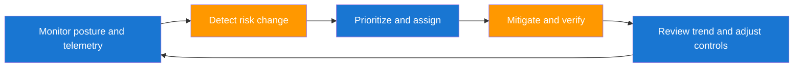

# Production Security Considerations and Operating Model

Production security work is continuous operations, not one-time projects. The system must keep working during outages, tool regressions, and organizational change. As a forward deployed engineer, your value comes from designing controls that hold up under pressure.

## Production Control Loop



## Operating Model Table

| Operating Domain | Minimum Standard | Cadence |
|---|---|---|
| Vulnerability triage | High-risk findings assigned with owner and SLA | Daily |
| Control verification | Fixes re-tested with artifact evidence | Continuous |
| Incident readiness | Tabletop playbooks current and rehearsed | Monthly |
| Executive reporting | Risk trend and mitigation effectiveness dashboard | Weekly |
| Exception governance | Time-bound risk exceptions with approver traceability | Weekly review |

## Operational Health Ratio

A compact health metric combines successful secure operations and critical failures.

$$
H_o = \frac{S_c}{S_c + F_h}
$$

| Symbol | Meaning |
|---|---|
| `H_o` | Operational security health ratio |
| `S_c` | Successful control-compliant execution cycles |
| `F_h` | High-severity failures requiring emergency intervention |

Use this with volume context so high ratios do not mask low testing throughput.

## Real-World Production Scenario: Leaked GCP Credential in CI Logs

A pipeline accidentally prints a GCP service account key or access token during a failed deployment. Even if the token is quickly removed from logs, assume compromise and execute full containment.

```bash
# containment sequence
gcloud iam service-accounts keys delete "$LEAKED_KEY_ID" \
    --iam-account "$SA_EMAIL" --quiet

# Prefer keyless auth for CI, but if a temporary token is required:
gcloud auth application-default print-access-token

# Search recent logs for accidental secret emission patterns
gcloud logging read \
    'textPayload:("private_key" OR "BEGIN PRIVATE KEY" OR "Authorization: Bearer")' \
    --freshness=7d --limit=50
gitleaks detect --source . --no-banner
```

| Remediation Phase | Required Action | Proof of Completion |
|---|---|---|
| Contain | Revoke exposed credential and rotate dependent secrets | Rotation log with timestamp and operator |
| Eradicate | Remove secret from pipeline output and scripts | PR merged with secret-safe logging |
| Recover | Re-run deployment with Workload Identity Federation and short-lived token model | Successful deployment and clean audit trail |
| Prevent | Add secret scanning and redaction controls | CI policy blocks future secret exposures |

## Operational Guardrail Example

```yaml
# Example SLA policy fragment
security_sla:
    critical:
        triage_within_hours: 4
        remediate_within_days: 3
    high:
        triage_within_hours: 24
        remediate_within_days: 14
```

## Continuous Security Validation Cadence

Security quality improves when checks run at multiple cadences, not only before releases.

| Cadence | What to Run | Why |
|---|---|---|
| Every pull request | Semgrep, unit security tests, authz negative tests | Prevents new loopholes from merging |
| Daily | Trivy filesystem and container scans | Captures dependency drift and new CVEs |
| Weekly | GCP IAM posture checks and SCC findings review | Catches cloud configuration drift |
| Monthly | Threat model refresh and tabletop drill | Validates assumptions under realistic failure scenarios |

## Security Score Model You Can Track Weekly

A practical score should reward cleaner scan output and penalize critical exposure.

$$
Score = max\left(0,\ 100 - (12C + 6H + 2M + 8S)\right)
$$

| Symbol | Meaning |
|---|---|
| C | Open critical vulnerabilities in production services |
| H | Open high vulnerabilities in production services |
| M | Open medium vulnerabilities in production services |
| S | Semgrep findings with severity `ERROR` |

Interpretation guideline:

- 90 to 100: strong control health
- 75 to 89: acceptable but needs focused hardening
- below 75: remediation sprint required

Optional governance extension for weekly leadership reporting:

$$
Score_{gov} = max\left(0,\ Score - 10E + 3V\right)
$$

where `E` is expired exceptions and `V` is verified fixes completed in the week.

## Example Scheduled Workflow for Regular Scans

```yaml
name: security-score

on:
    pull_request:
    schedule:
        - cron: "0 4 * * *"

jobs:
    scans:
        runs-on: ubuntu-latest
        steps:
            - uses: actions/checkout@v4

            - name: Trivy filesystem scan
              run: trivy fs --format json --output trivy.json .

            - name: Semgrep scan
              run: semgrep --config auto --json --output semgrep.json src/

            - name: Calculate score
              run: bash scripts/security-score.sh trivy.json semgrep.json

            - name: Upload score artifact
              uses: actions/upload-artifact@v4
              with:
                name: security-score
                path: security-score.json
```

Production-ready rollout instructions live in [reference/04-github-security-automation.md](../reference/04-github-security-automation.md).

## Production Rollout Checklist (Actionable)

1. Enable the workflow on PR and nightly schedule.
2. Make `Security Score (Trivy + Semgrep)` a required status check.
3. Define score policy:
   - score below 75 blocks merge unless approved exception exists.
   - any new critical vulnerability blocks merge.
4. Add ticket automation:
   - open issues automatically for new critical/high findings.
   - assign owner and due date from SLA.
5. Add weekly governance:
   - review score trend, exception count, and verified fixes.
   - close stale exceptions or renew with explicit sign-off.
6. Run monthly control validation drills:
   - intentionally test deny paths (401/403).
   - test one incident runbook end-to-end.

## GCP Cloud Drift Checks for Weekly Ops

```bash
# IAM policy snapshot
gcloud projects get-iam-policy "$PROJECT_ID" --format=json > iam-policy.json

# Top SCC findings snapshot
gcloud scc findings list "$ORG_ID" --limit=200 --format=json > scc-findings.json

# Optional: detect risky broad role grants
jq '.bindings[] | select(.role=="roles/owner" or .role=="roles/editor")' iam-policy.json
```

| Developer Watch-out | Better Practice |
|---|---|
| Treating credential leaks as low severity if short-lived | Always treat exposed tokens as compromised and rotate immediately. |
| Closing incidents without prevention action | Require one preventive control change before closure. |
| Manual-only incident handling | Automate first-response steps where possible. |

??? question "What should I report to leadership every week?"
    Report coverage of crown jewel assets, validated vulnerabilities fixed, MTTR trend, and active exceptions that exceed policy windows.

??? question "How do I protect against silent security drift?"
    Use freshness SLOs, anomaly alerts on finding patterns, and scheduled revalidation of key controls for critical systems.

??? question "How do I mature from engineer to trusted advisor?"
    Tie every technical recommendation to business risk, remediation feasibility, and measurable impact over time.

--8<-- "_abbreviations.md"
