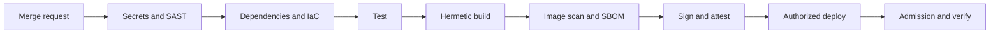

# Sequence 4: Software Supply Chain and Secure Delivery

**Phases 11–12 · Prerequisite:** Sequence 3 · **Outcome:** establish trust from source change to running artifact without turning security into indiscriminate pipeline friction.

## Phase 11 — Software Supply Chain

The supply chain includes developer identity, source host, dependencies, build workers, CI templates, package registries, container bases, artifacts, deployment identities, and runtime admission. A scanner covers only part of this attack surface.

| Control | Threat Addressed | Evidence |
|---|---|---|
| Protected branch and approvals | Unauthorized or unreviewed source change | Branch and approval policy export |
| Pinned CI templates/actions | Upstream template takeover or drift | Immutable version/digest |
| Lock file and integrity hashes | Dependency substitution or non-repeatable build | Reproducible dependency graph |
| Dependency and OSV scanning | Known vulnerable component | Pinned-version result and triage |
| Secret scanning | Credential committed to source/history | Pre-commit/CI result and rotation runbook |
| SAST/Semgrep | Repeatable source-level weakness | Reviewed rule and regression test |
| IaC/Checkov | Unsafe cloud configuration | Pipeline result and suppression rationale |
| Trivy/image scanning | Vulnerable OS/library image content | Image digest and scan artifact |
| SBOM | Unknown deployed component inventory | Artifact-linked SPDX/CycloneDX record |
| Signing and provenance | Artifact tampering or untrusted builder | Verified signature and build attestation |
| Admission policy | Unapproved artifact reaches runtime | Denied deployment test |

New versions are not automatically safer. Prefer established releases, verify provenance and maintainer signals, check vulnerabilities at the exact pinned version, review install scripts, and stage updates with tests. A CVE is prioritized using exploitability, reachability, privileges, sensitive-data access, compensating controls, and business impact.

**Exercise:** Trace one container from reviewed commit through build to GKE. At each handoff, state what is trusted, how it is authenticated, what can modify the artifact, and what evidence survives.

### Learning Session 11 — Prove Artifact Trust

**Objective:** Establish verifiable trust from developer change through the running GKE image.

**Scenario:** CI templates float by branch, dependencies are loosely pinned, the build runner is persistent, and deployment trusts an image tag.

**Facilitator flow:** Walk one artifact handoff at a time. Teach the threat before naming a scanner or signing tool.

1. Which identities and systems can change source, dependencies, build instructions, or artifacts?
2. Where can substitution, tampering, compromised maintainers, or untrusted runners enter?
3. What do pinning, lock files, SBOMs, scans, signatures, provenance, and admission each prevent?
4. Which findings are actually reachable and material in the deployed service?
5. How does the verifier bind reviewed source, trusted builder, immutable digest, and deployment?
6. What evidence survives for incident response and rollback?

**Artifact:** Commit-to-runtime trust map with threats, controls, identities, and evidence at every handoff.

**Evidence gate:** A pinned dependency graph, immutable image digest, linked SBOM, scan results, verified provenance/signature, and rejected untrusted deployment are reproducible.

**Adaptive branch:** If the learner treats scanning as trust, introduce a clean but malicious dependency. If strong, compromise the build worker after source approval.

## Phase 12 — Security in CI/CD

### Gate Policy

| Result | Default Treatment |
|---|---|
| Confirmed secret, public exposure, cross-tenant access, critical exploitable issue | Block and contain |
| New high-risk reachable vulnerability | Block unless authorized, time-bound exception |
| Existing high risk with compensating control | Track owner/SLA; prevent regression |
| Medium/low or uncertain tool result | Warn, triage by context, tune noisy rule |
| Tool outage | Fail according to control criticality; use documented continuity path |

A pipeline gate needs an owner, policy version, deterministic result, actionable remediation, exception workflow, and reliability SLO. False positives should be tuned or suppressed with evidence, not ignored globally. Exceptions identify affected asset, reason, compensating controls, approver, expiry, and revalidation date.

Separate source approval, build, artifact publication, and production deployment identities. Prefer ephemeral isolated runners and federated credentials; prevent untrusted fork code from accessing secrets. Do not print environment variables, tokens, Terraform outputs containing sensitive values, or request payloads.

### Metrics That Matter

- percentage of critical services with current SBOM and verified provenance;
- mean time to triage and verified remediation by risk class;
- age and expiry compliance of exceptions;
- control coverage and pipeline reliability;
- recurrence rate of previously fixed defect classes;
- blocked unauthorized releases and successful recovery drills.

Do not use raw finding count or a single synthetic score as proof of security improvement.

**Evidence gate:** Protected-branch policy, least-privilege CI identities, pinned templates, scan outputs, signed immutable artifact, admission denial, approved exception example, and rollback drill.

**FDE scenario:** Delivery is blocked by a noisy scanner. Explain how to preserve the meaningful gate, validate the finding, tune the rule, document a narrow exception if needed, and prevent security review from becoming unbounded delay.

### Learning Session 12 — Engineer a Defensible Delivery Gate

**Objective:** Decide what blocks, warns, or follows an exception based on risk and control reliability.

**Scenario:** A release contains a noisy high-severity SAST result, a medium SSRF finding on a public path, and a critical library CVE in unreachable test code.

**Facilitator flow:** Ask the learner to rank the release risks before revealing scanner severity or default gate policy.

1. Which asset and executable attack path does each finding affect?
2. What evidence establishes reachability, exploitability, exposure, and compensating controls?
3. Which result must block now, which may warn, and which needs a time-bound exception?
4. Who owns the gate, finding, exception, remediation, and risk acceptance?
5. How should tool outage, false positives, forked code, and rollback be handled safely?
6. Which metrics demonstrate risk reduction without rewarding finding volume?

**Artifact:** Versioned gate policy and a completed release decision containing remediation and exception records.

**Evidence gate:** The pipeline uses separated federated identities, protects secrets from untrusted code, produces actionable deterministic results, verifies immutable artifacts, and exercises rollback.

**Adaptive branch:** If severity alone drives the decision, reverse severity and exposure. If the decision is mature, make the critical gate unavailable during an emergency patch.

**Next:** [Sequence 5 — Operations, incidents, vulnerabilities, and governance](05-security-operations-governance.md).
