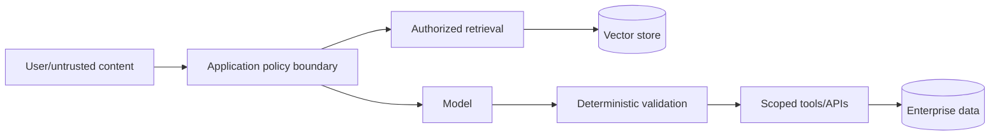

# Sequence 6: Security Architecture, AI, and FDE Leadership

**Phases 17–18 plus FDE practice · Prerequisite:** Sequence 5 · **Outcome:** design and defend viable enterprise solutions under technical, regulatory, and delivery constraints.

## Phase 17 — Security Architecture Method

For every architecture:

1. clarify business objective, users, environments, availability, data, and constraints;
2. identify assets, classification, owners, lifecycle, and crown jewels;
3. diagram data flows, entry points, dependencies, identities, and trust boundaries;
4. model actors, abuse cases, STRIDE threats, and complete attack paths;
5. choose preventive, detective, responsive, and recovery controls;
6. compare alternatives by risk reduction, usability, cost, reliability, and operability;
7. document assumptions, dependencies, residual risk, and authorized acceptance;
8. define negative tests, telemetry, incident actions, rollback, and review cadence.

| Scenario | Central Security Decisions |
|---|---|
| Public REST API | Caller identity, object/function authorization, abuse limits, WAF, origin and egress |
| Multi-tenant SaaS | Tenant identity, isolation at every layer, admin boundaries, noisy-neighbor limits |
| GCP data platform | Ingestion trust, classification, dataset scope, exports, key and retention ownership |
| GKE microservices | Workload identity, RBAC, network policy, admission, image trust, pod blast radius |
| Highly sensitive system | Stronger minimization, isolation, approvals, monitoring, recovery, and assurance evidence |

An architecture decision record should contain context, options, decision, security rationale, rejected alternatives, operational effects, residual risks, owner, evidence, and revisit trigger.

### Learning Session 17 — Defend an Enterprise Architecture

**Objective:** Produce a viable security architecture and defend its trade-offs under delivery constraints.

**Scenario:** A new partner needs a public API into the multi-tenant referral platform, with GKE services, PostgreSQL, BigQuery analytics, and highly sensitive data.

**Facilitator flow:** Gather requirements before controls. Ask one architecture question at a time and challenge unstated trust or operational assumptions.

1. What business outcome, users, data, availability target, environments, and constraints define success?
2. Which assets, identities, dependencies, entry points, data flows, and trust boundaries exist?
3. Which complete attack paths create the highest business impact?
4. Which preventive, detective, responsive, and recovery controls break or bound those paths?
5. What alternatives were considered, and how do risk reduction, usability, cost, reliability, and operability compare?
6. What residual risk, owner, negative test, telemetry, rollback, and revisit trigger remain?

**Artifact:** Architecture and data-flow diagrams, threat model, control matrix, and architecture decision record.

**Evidence gate:** Reviewers can trace every important control to a threat, reproduce negative evidence, identify residual-risk ownership, and operate or recover the design.

**Adaptive branch:** If controls are named before requirements, remove one assumed requirement. If the design is mature, add legacy identity, regional outage, and a fixed launch date.

## Phase 18 — AI, LLM, RAG, and Agent Security

Treat model output as untrusted and potentially attacker-influenced. A model does not become an authorization authority because it can interpret natural language.

| Threat | Design Response |
|---|---|
| Direct/indirect prompt injection | Separate instructions from content; constrain tools; assume retrieval is hostile |
| Sensitive disclosure | Minimize context, authorize retrieval, mask where approved, validate output and logs |
| Excessive agency | Human approval for high-impact actions; scoped tools, budgets, rate and time limits |
| Insecure tool use | Typed schemas, server-side authz, parameterized operations, path/URL confinement |
| RAG/vector isolation failure | Tenant filters enforced outside model; source ACL propagation; poisoning controls |
| Model/data poisoning | Provenance, approval, evaluation, monitoring, rollback, trusted source boundaries |
| Model supply chain | Approved models/providers, version controls, artifact/vendor assessment |
| Unsafe output | Treat as data; encode, validate, and authorize before execution or rendering |

Assess the lethal combination of untrusted input, sensitive-data access, and external side effects/egress. Break at least one path decisively and constrain all three. For PHI use cases, verify approved provider, data handling, retention, logging, region, and BAA status before sending data.

**Exercise:** Threat-model a referral summarization agent that retrieves records and can send partner notifications. Test malicious documents, cross-tenant retrieval, tool argument injection, unauthorized recipient, data in traces, retry duplication, and model/provider failure.

### Learning Session 18 — Constrain an Enterprise AI Agent

**Objective:** Treat model behavior as untrusted while preserving deterministic authorization and bounded side effects.

**Scenario:** A referral summarization agent retrieves tenant records, processes partner documents, and can send notifications through a tool. Model output currently selects records and recipients.

**Facilitator flow:** Begin with “what happens if the model is manipulated?” Require an attack path before discussing prompt defenses.

1. Where can direct or indirect untrusted instructions enter the application, retrieval, model, and tool flow?
2. Which sensitive data can the model receive, infer, disclose, log, or retrieve across tenants?
3. Which authorization decisions must remain outside the model and be rechecked at every tool or data boundary?
4. How are tool schemas, recipient rules, approvals, budgets, egress, retries, and idempotency constrained?
5. How are source ACLs, tenant filters, provenance, poisoning, model versions, and provider failure handled?
6. Which adversarial evaluations, telemetry, rollback, and incident actions prove the path is bounded?

**Artifact:** AI data-flow and trust-boundary diagram, threat model, tool-authorization matrix, and evaluation plan.

**Evidence gate:** Malicious content cannot cross tenant boundaries, select unauthorized tools or recipients, leak sensitive traces, duplicate high-impact actions, or bypass deterministic validation.

**Adaptive branch:** If prompt wording is the primary control, assume successful injection. If the architecture is strong, add compromised retrieval content and degraded model/provider behavior.

## FDE Customer Leadership

Use this response structure: **objective → asset/risk → requirement → options → recommendation → residual risk → owner/evidence**.

| Customer Statement | Security Response Goal |
|---|---|
| “Security review can happen later.” | Preserve delivery by identifying minimum pre-release controls and post-release work with owner |
| “Give the service account admin.” | Derive exact permissions, separate identities, and offer temporary controlled elevation if authorized |
| “It is internal, so no MFA/auth.” | Explain identity and lateral-movement risk without treating internal location as trust |
| “Disable the slow control.” | Diagnose friction, offer safer implementation, and use formal exception rather than silent bypass |
| “The issue is only medium.” | Re-rank using exposure, asset, exploit path, and blast radius |
| “Compliance requires this.” | Trace authoritative requirement to control objective and practical evidence |

Critique responses for technical accuracy, threat reasoning, risk framing, customer empathy, clear trade-offs, and avoidance of unnecessary complexity. Security theater adds cost without meaningful risk reduction; challenge it with the same rigor used for under-control.

## Final Capstone

Secure the reference platform for a new partner and sensitive-data workflow. Deliver architecture/data-flow diagrams, threat model, identity matrix, control decisions, API negative tests, data classification, cloud/Kubernetes evidence, supply-chain proof, detections, incident tabletop, vulnerability priorities, governance mapping, AI assessment if applicable, and a five-minute customer recommendation.

Pass when reviewers can reproduce the evidence, understand residual risk, identify the decision owner, and operate or recover the system without relying on undocumented expert knowledge.

**Continue:** Repeat the [adaptive learning system](../00-introduction/03-adaptive-learning-system.md) with harder constraints and revisit weak domains.
