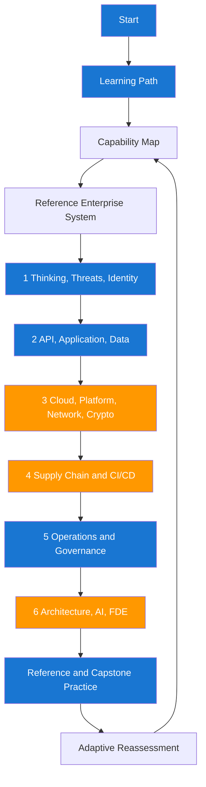

# Getting Started

Moving into enterprise security can feel overwhelming because the problem space is wide and the stakes are high. The fastest path is to combine structured learning with weekly applied practice in your own systems. This guide is built as a GCP-first action plan, not just reading material.

## Prerequisites

| Prerequisite | Why It Matters |
|---|---|
| Senior-level software development experience | You will reason about architecture and implementation trade-offs. |
| Google Cloud platform familiarity | Most enterprise security risks now live in cloud environments and identity boundaries. |
| Comfort with logs, APIs, and automation | Security testing and validation workflows are automation-heavy. |
| Willingness to collaborate across teams | Security outcomes require shared ownership and communication. |

## Key Questions This Guide Answers

| Your Question | Where You Will Learn It |
|---|---|
| What security considerations matter most in my organization first? | Sequences 1–3: threats, identity, data, and platform |
| How do I run security testing continuously without slowing delivery? | Sequence 4: supply chain and secure CI/CD |
| How do I reduce vulnerabilities and attacks over time? | Sequence 5: operations, incidents, and governance |
| How do I become one of the strongest engineers on the security team? | Sequence 6 plus the 30, 60, and 90 day milestones |

## Recommended Reading Flow

Start with the [capability map](00-introduction/02-capability-map.md), then learn the [reference enterprise system](00-introduction/02-reference-enterprise-system.md). Use the [adaptive learning system](00-introduction/03-adaptive-learning-system.md) after each exercise. If the work is for DaVita, apply the [enterprise guardrails](03-advanced/03-davita-enterprise-guardrails.md) throughout rather than waiting until the end.



## Study Habits That Work

| Habit | Practical Use |
|---|---|
| Use search aggressively | Find concepts quickly during architecture reviews and incidents. |
| Keep one weekly risk journal | Record top risks, decisions, and what changed after actions. |
| Practice one scenario per week | Build fluency in response and communication under pressure. |
| Use both light and dark themes | Reduce fatigue during long learning and incident sessions. |

## Safe Practice Boundary

Use synthetic data and isolated, authorized environments for all exercises. Never place PHI, PII, production credentials, internal hostnames, or restricted architecture in this repository or in external AI tools. Before active testing, document the target, techniques, time window, owner, rollback path, and explicit authorization.

## Local Tooling Bootstrap

| Tool | Why You Need It | Verification Command |
|---|---|---|
| Google Cloud SDK (`gcloud`) | Inspect IAM, logging, SCC findings, and service configs | `gcloud version` |
| Trivy | Dependency and container vulnerability scanning | `trivy --version` |
| Semgrep | Source-level security pattern detection | `semgrep --version` |
| Gitleaks | Secret leak detection | `gitleaks version` |
| jq | Parsing JSON scan output in scripts | `jq --version` |

```bash
# macOS quick start using Homebrew
brew install --cask google-cloud-sdk
brew install trivy semgrep gitleaks jq

# project-local baseline checks
trivy fs --severity HIGH,CRITICAL .
semgrep --config auto src/
gitleaks detect --source . --no-banner
gcloud auth list
```

## First Remediation Loop You Can Run This Week

| Step | Action | Done When |
|---|---|---|
| 1 | Pick one critical service and define scan scope | Service, repo, GCP project, and deployment target are documented |
| 2 | Run scans and remove obvious false positives | Findings are grouped by exploitability and linked to SCC or ticketing IDs |
| 3 | Open owner-specific tickets with reproduction notes | Every high-risk issue has an accountable owner |
| 4 | Patch, deploy, and re-test | Evidence confirms the issue is no longer reproducible in the target GCP environment |
| 5 | Record lessons in team retro | Prevention improvement is assigned |

## GitHub Action Plan You Can Execute Today

If you are about to push this project to GitHub, run these steps in order.

1. Create a new GitHub repository and push this project.
2. Ensure `scripts/security-score.sh` is executable.
3. Add the workflow file `.github/workflows/security-score.yml`.
4. Add required branch protection for `main`:
    - Require pull request reviews.
    - Require status check `Security Score (Trivy + Semgrep)`.
5. Open a test pull request and verify:
    - Scan artifacts are uploaded.
    - `security-score.json` is generated.
6. Start tracking weekly score trend in your team notes.

See detailed onboarding steps in [reference/04-github-security-automation.md](reference/04-github-security-automation.md).

```bash
# one-time setup before first push
chmod +x scripts/security-score.sh
git init
git add .
git commit -m "Initialize GCP security learning site with automated security scoring"
git branch -M main
git remote add origin <your-github-repo-url>
git push -u origin main
```

## Daily and Weekly Developer Routine

| Cadence | Action | Expected Output |
|---|---|---|
| Every PR | Run authz tests + Semgrep + Trivy in CI | PR blocked if critical issues introduced |
| Daily | Check open findings and create owner-assigned tickets | Prioritized remediation queue |
| Weekly | Review `security-score.json` trend and exceptions | Improvement plan for next sprint |
| Monthly | Review threat model and access boundaries | Reduced chance of recurring auth bugs |

??? question "How many hours per week should I commit?"
    A reliable baseline is five to seven hours per week, split between reading, hands-on testing, and retrospective notes.

??? question "What if my organization has no mature security program yet?"
    Start with asset inventory, identity hardening, and vulnerability triage hygiene. Those three give high leverage even in low-maturity environments.

--8<-- "_abbreviations.md"
