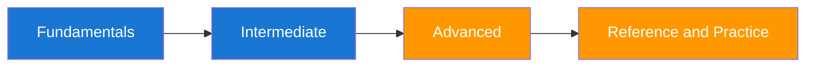

# Enterprise Security Growth Plan for a Forward Deployed Engineer

You already know how to build systems that work for customers. This guide helps you add enterprise security judgment so those systems are also safe under real adversarial pressure. It is tailored for Google Cloud environments and maps directly to the controls, tooling, and workflows GCP teams use in production.



## Why This Guide Exists

You asked for a CISO-style plan that teaches security considerations and security testing you can keep applying in your organization. The curriculum focuses on reducing real vulnerability exposure, improving remediation speed, and building repeatable engineering habits using GCP-native services such as Security Command Center, Cloud Logging, Cloud Armor, Secret Manager, and GKE/Cloud Run controls. Each section is mapped to actions you can execute during your first 30, 60, and 90 days.

## Section Map and Difficulty

| Section | Outcome | Difficulty |
|---|---|---|
| Sequences 1–2 | Security thinking, threats, identity, APIs, applications, and data | Foundation |
| Sequences 3–4 | GCP, Kubernetes, networks, cryptography, supply chain, and CI/CD | Practitioner |
| Sequences 5–6 | Incidents, observability, vulnerabilities, governance, architecture, AI, and FDE leadership | Advanced |
| Reference | Fast lookup, regression packs, standards, and runbooks | All levels |

## Curriculum Operating Model

Use the [Enterprise Security Capability Map](00-introduction/02-capability-map.md) as the complete domain index. Every module evolves the same [reference enterprise system](00-introduction/02-reference-enterprise-system.md), and the [adaptive learning system](00-introduction/03-adaptive-learning-system.md) selects exercises from demonstrated gaps rather than pages completed. For DaVita delivery work, apply the [enterprise guardrails](03-advanced/03-davita-enterprise-guardrails.md) and verify every requirement against current authoritative internal policy.

The guide separates four kinds of content so it remains maintainable:

- **Learn:** durable concepts and security decision models;
- **Apply:** architecture, implementation, and negative-testing exercises;
- **Operate:** detection, incident, vulnerability, and governance workflows;
- **Reference:** concise checklists and runbooks for delivery work.

## Quick Navigation

=== "First 30 Days"
    Complete [Sequence 1](04-curriculum/01-security-thinking-threats-identity.md) and [Sequence 2](04-curriculum/02-api-application-data.md). Produce a threat model, identity matrix, API deny tests, and data-flow classification.

=== "60 Day Builder"
    Complete [Sequence 3](04-curriculum/03-cloud-platform-network-crypto.md) and [Sequence 4](04-curriculum/04-supply-chain-cicd.md). Produce cloud/platform control evidence and a verifiable secure delivery path.

=== "90 Day Leader"
    Complete [Sequence 5](04-curriculum/05-security-operations-governance.md) and [Sequence 6](04-curriculum/06-architecture-ai-fde.md). Lead an incident exercise and defend the final architecture capstone.

## Real-World Execution Starter

| Week | What You Actually Do | Output You Share |
|---|---|---|
| 1 | Inventory internet-facing services and map auth mechanisms | Asset register with owner and data classification |
| 2 | Run baseline dependency and config scans on top-tier services | Prioritized findings list with severity and exploitability |
| 3 | Open remediation tickets with fixed due dates and test criteria | Team dashboard with open, in-progress, and verified fixes |
| 4 | Re-test remediated items and document residual risk | Weekly risk delta report for engineering leadership |

```bash
# Minimal weekly GCP security loop for one service
trivy fs --severity HIGH,CRITICAL .
semgrep --config auto src/
npm audit --audit-level=high
gcloud scc findings list "$ORG_ID" --filter='severity="HIGH" OR severity="CRITICAL"' --limit=20
```

| Developer Watch-out | Why It Hurts | Better Move |
|---|---|---|
| Shipping scanner output directly to Slack | Creates alert fatigue and low ownership | Create owner-tagged tickets with reproduction context |
| Tracking only finding volume | Can hide stalled remediation | Track verified fixes and time-to-remediate |
| Running scans without service context | Produces false urgency | Tag findings by crown-jewel relevance |

??? question "How do I know this is improving security and not just creating more reports?"
    Track validated risk reduction and remediation speed, not scanner volume. The formulas and scorecards in this site are built for outcome measurement.

??? question "Can I use this even if I have never worked in enterprise security?"
    Yes. The sequence starts with plain-language foundations and progressively introduces governance, architecture, and production response practices.

--8<-- "_abbreviations.md"
