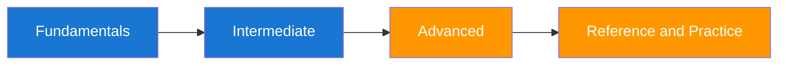

# Enterprise Security Growth Plan for a Forward Deployed Engineer

You already know how to build systems that work for customers. This guide helps you add enterprise security judgment so those systems are also safe under real adversarial pressure. It is tailored for Google Cloud environments and maps directly to the controls, tooling, and workflows GCP teams use in production.



## Why This Guide Exists

You asked for a CISO-style plan that teaches security considerations and security testing you can keep applying in your organization. The curriculum focuses on reducing real vulnerability exposure, improving remediation speed, and building repeatable engineering habits using GCP-native services such as Security Command Center, Cloud Logging, Cloud Armor, Secret Manager, and GKE/Cloud Run controls. Each section is mapped to actions you can execute during your first 30, 60, and 90 days.

## Section Map and Difficulty

| Section | Outcome | Difficulty |
|---|---|---|
| Fundamentals | Understand risk, controls, and enterprise threat modeling basics | 🟢 |
| Intermediate | Build secure architecture and practical test workflows | 🟡 |
| Advanced | Operate a production security program with metrics and governance | 🔴 |
| Reference | Fast lookup for daily work and interview-style drills | 🟢 to 🔴 |

## Quick Navigation

=== "First 30 Days"
    Start with Fundamentals and the Learning Path page. Focus on asset criticality, threat modeling, and access-control hygiene.

=== "60 Day Builder"
    Move to Intermediate pages and implement testing pipelines, triage workflows, and secure delivery controls.

=== "90 Day Leader"
    Focus on Advanced pages for operating model design, security SLOs, and executive reporting patterns.

## Real-World Execution Starter

| Week | What You Actually Do | Output You Share |
|---|---|---|
| 1 | Inventory internet-facing services and map auth mechanisms | Asset register with owner and data classification |
| 2 | Run baseline dependency and config scans on top-tier services | Prioritized findings list with severity and exploitability |
| 3 | Open remediation tickets with fixed due dates and test criteria | Team dashboard with open, in-progress, and verified fixes |
| 4 | Re-test remediated items and document residual risk | Weekly risk delta report for engineering leadership |

```bash
# Minimal weekly GCP security loop for one service
trivy fs --severity HIGH,CRITICAL .
semgrep --config auto src/
npm audit --audit-level=high
gcloud scc findings list "$ORG_ID" --filter='severity="HIGH" OR severity="CRITICAL"' --limit=20
```

| Developer Watch-out | Why It Hurts | Better Move |
|---|---|---|
| Shipping scanner output directly to Slack | Creates alert fatigue and low ownership | Create owner-tagged tickets with reproduction context |
| Tracking only finding volume | Can hide stalled remediation | Track verified fixes and time-to-remediate |
| Running scans without service context | Produces false urgency | Tag findings by crown-jewel relevance |

??? question "How do I know this is improving security and not just creating more reports?"
    Track validated risk reduction and remediation speed, not scanner volume. The formulas and scorecards in this site are built for outcome measurement.

??? question "Can I use this even if I have never worked in enterprise security?"
    Yes. The sequence starts with plain-language foundations and progressively introduces governance, architecture, and production response practices.

--8<-- "_abbreviations.md"
