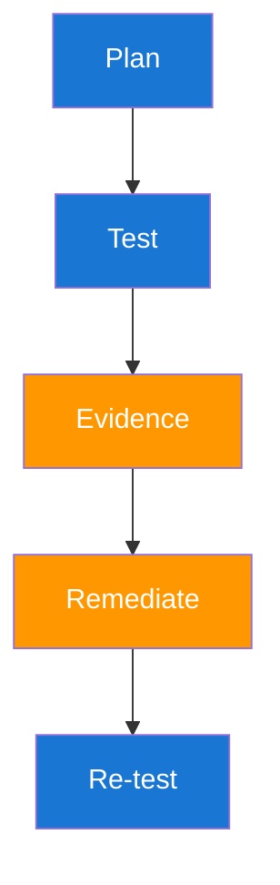

# Security Testing Cheatsheet

This cheatsheet is designed for practical execution under time pressure. Keep it open during testing sessions and design reviews. It gives you quick structures for planning, validation, and communication.



## Testing Method Comparison

| Method | Best For | Limitation |
|---|---|---|
| SAST | Early code-level flaw discovery | Weak runtime context |
| DAST | Runtime behavior validation | Limited code-path insight |
| IAST | Context-aware runtime analysis | Instrumentation overhead |
| Pentest | Realistic attack-path validation | Higher labor and scheduling cost |

## Execution Checklist Table

| Step | Input Needed | Output Required |
|---|---|---|
| Scope | Asset list and authorization | Approved test boundary |
| Validate | Hypotheses and tools | Evidence with confidence |
| Report | Owner map and impact context | Actionable ticket set |
| Verify | Fix release details | Closure evidence and retest result |

## Throughput Equation

A compact metric for weekly program updates is fix throughput.

$$
T_f = \frac{N_v}{W}
$$

| Symbol | Meaning |
|---|---|
| `T_f` | Verified fix throughput per week |
| `N_v` | Number of verified fixes in period |
| `W` | Number of weeks in the period |

## Developer-Ready Snippets

```yaml
# Minimal GKE container hardening baseline
securityContext:
    runAsNonRoot: true
    allowPrivilegeEscalation: false
    readOnlyRootFilesystem: true
```

```bash
# GCP IAM binding inspection for one project
gcloud projects get-iam-policy "$PROJECT_ID" --format=json | jq '.bindings[] | {role, members}'
```

```bash
# Verify an API denies unauthorized access
curl -s -o /dev/null -w "%{http_code}\n" \
    -H "Authorization: Bearer $INVALID_SCOPE_TOKEN" \
    https://api.example.com/internal/reports
```

| Expected Result | Meaning |
|---|---|
| `403` | Authenticated but not authorized, which is correct |
| `401` | Token invalid or expired |
| `200` | Potential authorization gap requiring immediate review |

## Remediation Prioritization Grid

| Priority | Criteria | Typical Action Window |
|---|---|---|
| P0 | Internet-facing, exploitable, high business impact | Same day |
| P1 | Exploitable with moderate impact | 3 to 7 days |
| P2 | Limited exploitability or low impact | Sprint backlog |
| P3 | Hardening and hygiene improvements | Planned maintenance |

??? question "How do I pick between SAST and DAST first?"
    Use both eventually, but start with the one matching your biggest risk area and current delivery stage. For runtime exposure, prioritize DAST and targeted manual checks.

??? question "What makes a ticket actionable for engineering teams?"
    Reproducible evidence, clear impact, owner mapping, and specific remediation guidance with verification criteria.

--8<-- "_abbreviations.md"
