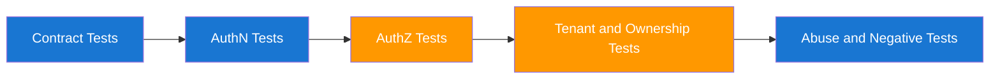

# API Security Regression Test Pack

Use this pack to prevent authorization and validation regressions across releases. Keep these tests in CI and treat failures as release blockers for high-risk APIs.

## 1. Test Suite Strategy



## 2. Must-Have Cases Per Protected Endpoint

| Test Case | Expected |
|---|---|
| Missing token | `401` |
| Expired/invalid token | `401` |
| Valid token, wrong scope | `403` |
| Valid scope, wrong tenant | `403` |
| Valid scope and tenant | `200` or intended success code |
| Object not owned by caller | `403` or resource-hidden `404` per policy |

## 3. Curl Regression Pack (Copy-Paste)

```bash
BASE_URL="https://api.example.com"

# Missing token
curl -i "$BASE_URL/api/orders/123"

# Invalid token
curl -i -H "Authorization: Bearer invalid" "$BASE_URL/api/orders/123"

# Wrong scope
curl -i -H "Authorization: Bearer $TOKEN_WITHOUT_ORDERS_READ" "$BASE_URL/api/orders/123"

# Cross-tenant access
curl -i -H "Authorization: Bearer $OTHER_TENANT_TOKEN" "$BASE_URL/api/orders/123"

# Valid access
curl -i -H "Authorization: Bearer $VALID_TOKEN" "$BASE_URL/api/orders/123"
```

## 4. Spring Boot Integration Tests

```java
@AutoConfigureMockMvc
@SpringBootTest
class OrderApiSecurityRegressionTests {

    @Autowired
    MockMvc mvc;

    @Test
    void missingToken_returns401() throws Exception {
        mvc.perform(get("/api/orders/123"))
            .andExpect(status().isUnauthorized());
    }

    @Test
    void wrongScope_returns403() throws Exception {
        mvc.perform(get("/api/orders/123")
                .with(jwt().authorities(new SimpleGrantedAuthority("SCOPE_profile.read"))))
            .andExpect(status().isForbidden());
    }

    @Test
    void crossTenant_returns403() throws Exception {
        mvc.perform(get("/api/orders/123")
                .with(jwt().jwt(j -> j.claim("tenant_id", "tenant-b"))
                .authorities(new SimpleGrantedAuthority("SCOPE_orders.read"))))
            .andExpect(status().isForbidden());
    }
}
```

## 5. Abuse-Path Scenarios to Automate

| Scenario | Why It Matters | Expected Outcome |
|---|---|---|
| IDOR via predictable IDs | Common data exposure vector | Access denied for non-owner |
| Mass assignment on PATCH/PUT | Privilege escalation via extra fields | Unknown/sensitive fields ignored or rejected |
| Pagination overreach | Data scraping and tenant bleed | Strict server-side filtering |
| Rate abuse | Credential stuffing and scraping | 429 or throttling control |

## 6. CI Gate Criteria

1. All authN/authZ regression tests must pass.
2. Any new `401` to `200` or `403` to `200` change requires explicit security approval.
3. Any cross-tenant test failure blocks merge.

## 7. Test Data and Token Hygiene

| Rule | Practice |
|---|---|
| Do not use real production tokens | Use generated test tokens in isolated environments |
| Do not log raw tokens in CI | Mask or redact sensitive auth artifacts |
| Separate tenant fixtures | Keep clear tenant-a and tenant-b fixtures |

## 8. Release Checklist for API Security

1. Run full regression suite against staging.
2. Verify logs for denied actions include correlation IDs.
3. Confirm rate-limit and abuse controls are active.
4. Re-run top 5 abuse-path tests after deployment.

## 9. Evidence Artifact Format

Store these per release:

- test suite commit SHA
- timestamp and environment
- failed/passed authN/authZ test summary
- security sign-off decision

--8<-- "_abbreviations.md"
