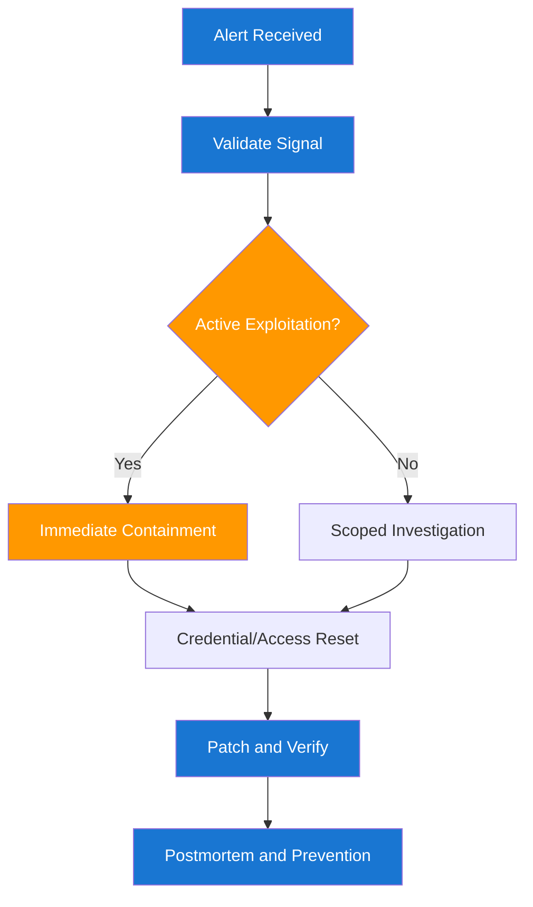

# GCP Incident Runbooks for Engineers

These runbooks are designed for the first 30 to 60 minutes of response, where containment quality matters most. Use detect, contain, eradicate, recover, and prevent as the default execution model.

## 1. First 15 Minutes Checklist

1. Declare severity and start incident channel.
2. Assign incident commander and communications owner.
3. Preserve evidence before making destructive changes.
4. Start containment on highest blast-radius vectors.
5. Create a running timeline with timestamps.

## 2. Incident Decision Flow



## 3. Runbook: Suspected Credential Leak

### Detect

```bash
gcloud logging read \
  'textPayload:("private_key" OR "BEGIN PRIVATE KEY" OR "Authorization: Bearer")' \
  --freshness=24h --limit=100
```

### Contain

```bash
# Disable leaked service account key
gcloud iam service-accounts keys delete "$LEAKED_KEY_ID" \
  --iam-account "$SA_EMAIL" --quiet
```

### Eradicate

1. Remove leak source in pipeline or code.
2. Rotate dependent credentials and update secret references.
3. Enforce keyless auth where possible.

### Recover

1. Redeploy with clean credentials.
2. Validate critical endpoints and workflows.

### Prevent

1. Add or tighten secret scanning in CI.
2. Add log redaction and output hygiene checks.

## 4. Runbook: Public GCS Data Exposure

### Detect

```bash
gcloud storage buckets get-iam-policy gs://$BUCKET_NAME
```

### Contain

```bash
# Remove public access bindings
gcloud storage buckets remove-iam-policy-binding gs://$BUCKET_NAME \
  --member=allUsers \
  --role=roles/storage.objectViewer
```

### Verify

1. Attempt unauthenticated object access and confirm denial.
2. Confirm expected principals still retain required access.

### Prevent

1. Add IaC policy checks to block public bucket bindings.
2. Enable periodic bucket policy review in weekly ops.

## 5. Runbook: Over-Privileged IAM Assignment

### Detect

```bash
gcloud projects get-iam-policy "$PROJECT_ID" --format=json > iam-policy.json
jq '.bindings[] | select(.role=="roles/owner" or .role=="roles/editor")' iam-policy.json
```

### Contain

1. Remove broad role from non-admin principals.
2. Replace with least-privilege custom or predefined role.

### Verify

1. Re-run affected service workflows.
2. Confirm no privileged operations outside intended scope.

## 6. Runbook: API Authorization Bypass

### Detect

1. Review logs for unusual access patterns or cross-tenant reads.
2. Reproduce with negative auth test cases.

### Contain

1. Disable vulnerable route if needed.
2. Add emergency policy at gateway or WAF layer.

### Eradicate

1. Implement missing scope/role checks.
2. Add tenant or ownership checks in service layer.

### Recover

1. Redeploy patch.
2. Re-run API regression pack from [06-api-security-regression-test-pack.md](06-api-security-regression-test-pack.md).

## 7. Evidence and Timeline Template

```markdown
Incident ID:
Service:
Detected at:
Reporter:

Timeline:
- 10:02 UTC: Alert triggered
- 10:05 UTC: Incident channel created
- 10:11 UTC: Containment command executed
- 10:25 UTC: Validation complete

Impact:
Root cause:
Containment:
Recovery:
Prevention actions:
Owner + due date:
```

## 8. Post-Incident Engineering Actions

1. Add regression tests that reproduce the incident class.
2. Add one prevention control to CI or policy layer.
3. Add detection rule updates to reduce time-to-detect.
4. Share incident learnings in weekly engineering review.

--8<-- "_abbreviations.md"
